# NeRFs-ICCV2021

> - 当前论文数：23
> - 收集来源：[ICCV 2021 open access](https://openaccess.thecvf.com/ICCV2021?day=all))  注：搜索词(“nerf” OR “radiance” OR “slam”)

---

[1] PlenOctrees for Real-time Rendering of Neural Radiance Fields

- Title：用于神经辐射场实时渲染的PlenOctrees

- Category：实时

- Project: https://alexyu.net/plenoctrees/

- Code: https://github.com/sxyu/volrend

- Paper: https://arxiv.org/pdf/2103.14024

- Abstract：

  > *We introduce a method to render Neural Radiance Fields (NeRFs) in real time using PlenOctrees, an octree-based 3D representation which supports view-dependent effects. Our method can render 800x800 images at more than 150 FPS, which is over 3000 times faster than conventional NeRFs. We do so without sacrificing quality while preserving the ability of NeRFs to perform free-viewpoint rendering of scenes with arbitrary geometry and view-dependent effects. Real-time performance is achieved by pre-tabulating the NeRF into a PlenOctree. In order to preserve view-dependent effects such as specularities, we factorize the appearance via closed-form spherical basis functions. Specifically, we show that it is possible to train NeRFs to predict a spherical harmonic representation of radiance, removing the viewing direction as an input to the neural network. Furthermore, we show that PlenOctrees can be directly optimized to further minimize the reconstruction loss, which leads to equal or better quality compared to competing methods. Moreover, this octree optimization step can be used to reduce the training time, as we no longer need to wait for the NeRF training to converge fully. Our real-time neural rendering approach may potentially enable new applications such as 6-DOF industrial and product visualizations, as well as next generation AR/VR systems. PlenOctrees are amenable to in-browser rendering as well; please visit the project page for the interactive online demo, as well as video and code: [this https URL](https://alexyu.net/plenoctrees)*

- Figure：

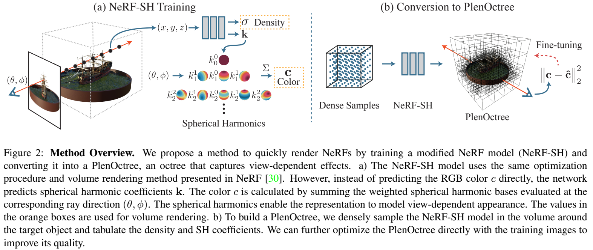

---

[2] Neural Radiance Flow for 4D View Synthesis and Video Processing

- Title：用于4D视图合成和视频处理的神经辐射流

- Category：动态场景

- Project: https://yilundu.github.io/nerflow/

- Code: https://github.com/yilundu/nerflow

- Paper: https://arxiv.org/pdf/2012.09790.pdf

- Abstract：

  > *We present a method, Neural Radiance Flow (NeRFlow),to learn a 4D spatial-temporal representation of a dynamic scene from a set of RGB images. Key to our approach is the use of a neural implicit representation that learns to capture the 3D occupancy, radiance, and dynamics of the scene. By enforcing consistency across different modalities, our representation enables multi-view rendering in diverse dynamic scenes, including water pouring, robotic interaction, and real images, outperforming state-of-the-art methods for spatial-temporal view synthesis. Our approach works even when inputs images are captured with only one camera. We further demonstrate that the learned representation can serve as an implicit scene prior, enabling video processing tasks such as image super-resolution and de-noising without any additional supervision.*

- Figure：

---

[3] Unconstrained Scene Generation with Locally Conditioned Radiance Fields

- Title：具有局部条件辐射场的无约束场景生成

- Category：NeRF-GAN

- Project: https://apple.github.io/ml-gsn/

- Code: https://github.com/apple/ml-gsn

- Paper: https://arxiv.org/pdf/2104.00670.pdf

- Abstract：

  > *We tackle the challenge of learning a distribution over complex, realistic, indoor scenes. In this paper, we introduce Generative Scene Networks (GSN), which learns to decompose scenes into a collection of many local radiance fields that can be rendered from a free moving camera. Our model can be used as a prior to generate new scenes, or to complete a scene given only sparse 2D observations. Recent work has shown that generative models of radiance fields can capture properties such as multi-view consistency and view-dependent lighting. However, these models are specialized for constrained viewing of single objects, such as cars or faces. Due to the size and complexity of realistic indoor environments, existing models lack the representational capacity to adequately capture them. Our decomposition scheme scales to larger and more complex scenes while preserving details and diversity, and the learned prior enables high-quality rendering from viewpoints that are significantly different from observed viewpoints. When compared to existing models, GSN produces quantitatively higher-quality scene renderings across several different scene datasets.*

- Figure：

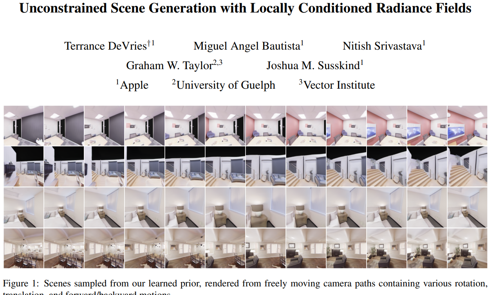

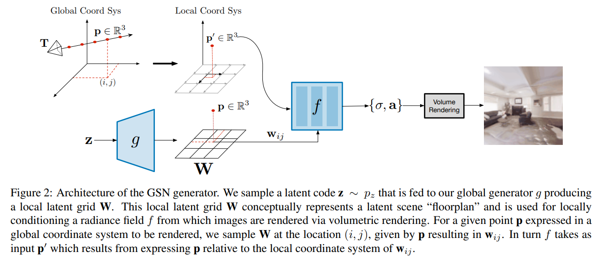

---

[4] AD-NeRF: Audio Driven Neural Radiance Fields for Talking Head Synthesis

- Title：AD-NeRF：用于说话头部合成的音频驱动神经辐射场

- Category：人脸建模,音频驱动

- Project: https://yudongguo.github.io/ADNeRF/

- Code: https://github.com/YudongGuo/AD-NeRF

- Paper: https://arxiv.org/pdf/2103.11078.pdf

- Abstract：

  > *Generating high-fidelity talking head video by fitting with the input audio sequence is a challenging problem that receives considerable attentions recently. In this paper, we address this problem with the aid of neural scene representation networks. Our method is completely different from existing methods that rely on intermediate representations like 2D landmarks or 3D face models to bridge the gap between audio input and video output. Specifically, the feature of input audio signal is directly fed into a conditional implicit function to generate a dynamic neural radiance field, from which a high-fidelity talking-head video corresponding to the audio signal is synthesized using volume rendering. Another advantage of our framework is that not only the head (with hair) region is synthesized as previous methods did, but also the upper body is generated via two individual neural radiance fields. Experimental results demonstrate that our novel framework can (1) produce high-fidelity and natural results, and (2) support free adjustment of audio signals, viewing directions, and background images. Code is available at [this https URL](https://github.com/YudongGuo/AD-NeRF).*

- Figure：

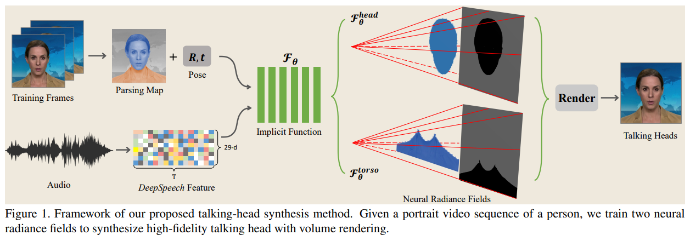

---

[5] Animatable Neural Radiance Fields for Modeling Dynamic Human Bodies

- Title：用于模拟动态人体的动画神经辐射场

- Category：动态人体

- Project: https://zju3dv.github.io/animatable_nerf/

- Code: https://github.com/zju3dv/animatable_nerf

- Paper: https://arxiv.org/pdf/2105.02872.pdf

- Abstract：

  > *This paper addresses the challenge of reconstructing an animatable human model from a multi-view video. Some recent works have proposed to decompose a non-rigidly deforming scene into a canonical neural radiance field and a set of deformation fields that map observation-space points to the canonical space, thereby enabling them to learn the dynamic scene from images. However, they represent the deformation field as translational vector field or SE(3) field, which makes the optimization highly under-constrained. Moreover, these representations cannot be explicitly controlled by input motions. Instead, we introduce neural blend weight fields to produce the deformation fields. Based on the skeleton-driven deformation, blend weight fields are used with 3D human skeletons to generate observation-to-canonical and canonical-to-observation correspondences. Since 3D human skeletons are more observable, they can regularize the learning of deformation fields. Moreover, the learned blend weight fields can be combined with input skeletal motions to generate new deformation fields to animate the human model. Experiments show that our approach significantly outperforms recent human synthesis methods. The code and supplementary materials are available at [this https URL](https://zju3dv.github.io/animatable_nerf/).*

- Figure：

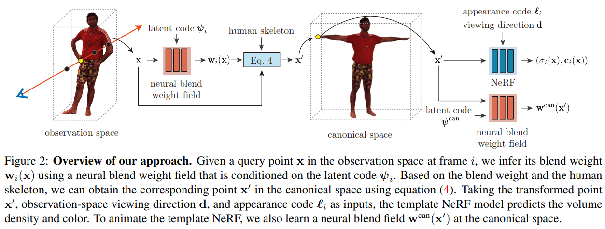

---

[6] GNeRF: GAN-based Neural Radiance Field without Posed Camera

- Title：GNeRF：没有位姿相机的基于GAN的神经辐射场

- Category：NeRF-GAN,无位姿

- Project: none

- Code: https://github.com/quan-meng/gnerf

- Paper: https://arxiv.org/pdf/2103.15606.pdf

- Abstract：

  > *We introduce GNeRF, a framework to marry Generative Adversarial Networks (GAN) with Neural Radiance Field (NeRF) reconstruction for the complex scenarios with unknown and even randomly initialized camera poses. Recent NeRF-based advances have gained popularity for remarkable realistic novel view synthesis. However, most of them heavily rely on accurate camera poses estimation, while few recent methods can only optimize the unknown camera poses in roughly forward-facing scenes with relatively short camera trajectories and require rough camera poses initialization. Differently, our GNeRF only utilizes randomly initialized poses for complex outside-in scenarios. We propose a novel two-phases end-to-end framework. The first phase takes the use of GANs into the new realm for optimizing coarse camera poses and radiance fields jointly, while the second phase refines them with additional photometric loss. We overcome local minima using a hybrid and iterative optimization scheme. Extensive experiments on a variety of synthetic and natural scenes demonstrate the effectiveness of GNeRF. More impressively, our approach outperforms the baselines favorably in those scenes with repeated patterns or even low textures that are regarded as extremely challenging before.*

- Figure：

---

[7] BARF: Bundle-Adjusting Neural Radiance Fields

- Title：BARF：捆绑调整神经辐射场

- Category：Bundle-Adjusting

- Project: https://chenhsuanlin.bitbucket.io/bundle-adjusting-NeRF/

- Code: https://github.com/chenhsuanlin/bundle-adjusting-NeRF

- Paper: https://arxiv.org/pdf/2104.06405.pdf

- Abstract：

  > *Neural Radiance Fields (NeRF) have recently gained a surge of interest within the computer vision community for its power to synthesize photorealistic novel views of real-world scenes. One limitation of NeRF, however, is its requirement of accurate camera poses to learn the scene representations. In this paper, we propose Bundle-Adjusting Neural Radiance Fields (BARF) for training NeRF from imperfect (or even unknown) camera poses -- the joint problem of learning neural 3D representations and registering camera frames. We establish a theoretical connection to classical image alignment and show that coarse-to-fine registration is also applicable to NeRF. Furthermore, we show that naïvely applying positional encoding in NeRF has a negative impact on registration with a synthesis-based objective. Experiments on synthetic and real-world data show that BARF can effectively optimize the neural scene representations and resolve large camera pose misalignment at the same time. This enables view synthesis and localization of video sequences from unknown camera poses, opening up new avenues for visual localization systems (e.g. SLAM) and potential applications for dense 3D mapping and reconstruction.*

- Figure：

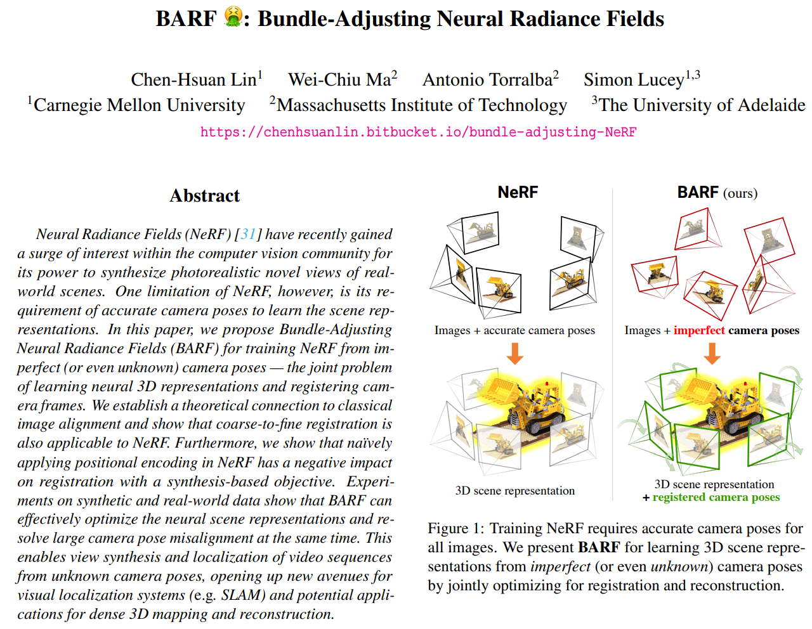

---

[8] Editing Conditional Radiance Fields

- Title：编辑条件辐射场

- Category：可编辑,外观编辑,几何编辑

- Project: http://editnerf.csail.mit.edu/

- Code: https://github.com/stevliu/editnerf

- Paper: https://arxiv.org/pdf/2105.06466.pdf

- Abstract：

  > *A neural radiance field (NeRF) is a scene model supporting high-quality view synthesis, optimized per scene. In this paper, we explore enabling user editing of a category-level NeRF - also known as a conditional radiance field - trained on a shape category. Specifically, we introduce a method for propagating coarse 2D user scribbles to the 3D space, to modify the color or shape of a local region. First, we propose a conditional radiance field that incorporates new modular network components, including a shape branch that is shared across object instances. Observing multiple instances of the same category, our model learns underlying part semantics without any supervision, thereby allowing the propagation of coarse 2D user scribbles to the entire 3D region (e.g., chair seat). Next, we propose a hybrid network update strategy that targets specific network components, which balances efficiency and accuracy. During user interaction, we formulate an optimization problem that both satisfies the user's constraints and preserves the original object structure. We demonstrate our approach on various editing tasks over three shape datasets and show that it outperforms prior neural editing approaches. Finally, we edit the appearance and shape of a real photograph and show that the edit propagates to extrapolated novel views.*

- Figure：

---

[9] GRF: Learning a General Radiance Field for 3D Representation and Rendering

- Title：GRF：学习用于3D表示和渲染的一般辐射场

- Category：视图合成

- Project: none

- Code: https://github.com/alextrevithick/GRF

- Paper: https://arxiv.org/pdf/2010.04595.pdf

- Abstract：

  > *We present a simple yet powerful neural network that implicitly represents and renders 3D objects and scenes only from 2D observations. The network models 3D geometries as a general radiance field, which takes a set of 2D images with camera poses and intrinsics as input, constructs an internal representation for each point of the 3D space, and then renders the corresponding appearance and geometry of that point viewed from an arbitrary position. The key to our approach is to learn local features for each pixel in 2D images and to then project these features to 3D points, thus yielding general and rich point representations. We additionally integrate an attention mechanism to aggregate pixel features from multiple 2D views, such that visual occlusions are implicitly taken into account. Extensive experiments demonstrate that our method can generate high-quality and realistic novel views for novel objects, unseen categories and challenging real-world scenes.*

- Figure：

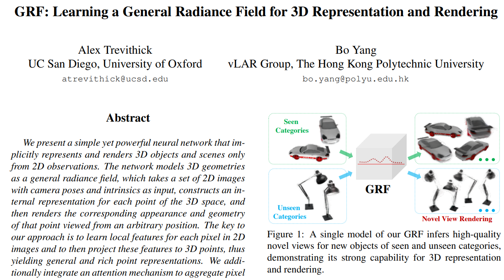

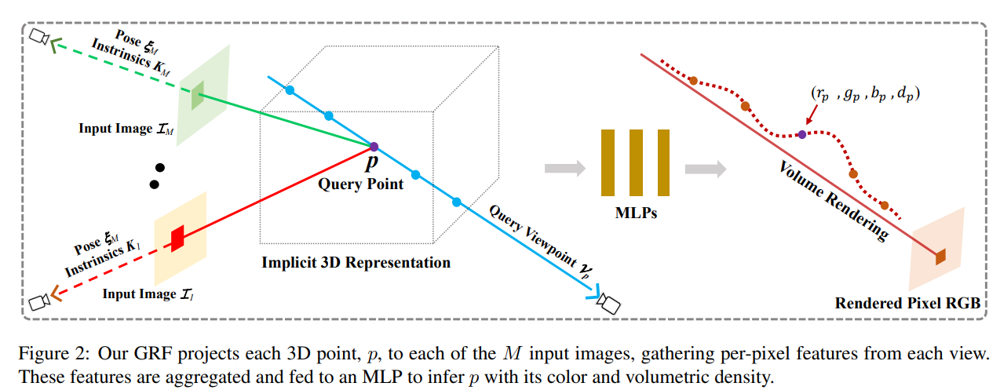

---

[10] Neural Articulated Radiance Field

- Title：神经关节辐射场

- Category：动态人体

- Project: none

- Code: https://github.com/nogu-atsu/NARF

- Paper: https://arxiv.org/pdf/2104.03110.pdf

- Abstract：

  > *We present Neural Articulated Radiance Field (NARF), a novel deformable 3D representation for articulated objects learned from images. While recent advances in 3D implicit representation have made it possible to learn models of complex objects, learning pose-controllable representations of articulated objects remains a challenge, as current methods require 3D shape supervision and are unable to render appearance. In formulating an implicit representation of 3D articulated objects, our method considers only the rigid transformation of the most relevant object part in solving for the radiance field at each 3D location. In this way, the proposed method represents pose-dependent changes without significantly increasing the computational complexity. NARF is fully differentiable and can be trained from images with pose annotations. Moreover, through the use of an autoencoder, it can learn appearance variations over multiple instances of an object class. Experiments show that the proposed method is efficient and can generalize well to novel poses. The code is available for research purposes at [this https URL](https://github.com/nogu-atsu/NARF)*

- Figure：

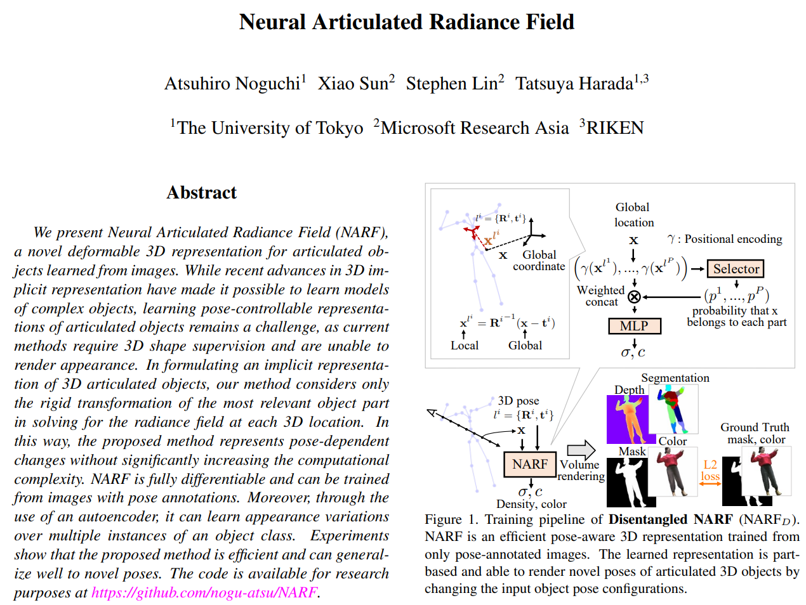

---

[11] Learning Object-Compositional Neural Radiance Field for Editable Scene Rendering

- Title：用于可编辑场景渲染的学习对象合成神经辐射场

- Category：对象编辑

- Project: https://zju3dv.github.io/object_nerf/

- Code: https://github.com/zju3dv/object_nerf

- Paper: https://arxiv.org/pdf/2109.01847.pdf

- Abstract：

  > *Implicit neural rendering techniques have shown promising results for novel view synthesis. However, existing methods usually encode the entire scene as a whole, which is generally not aware of the object identity and limits the ability to the high-level editing tasks such as moving or adding furniture. In this paper, we present a novel neural scene rendering system, which learns an object-compositional neural radiance field and produces realistic rendering with editing capability for a clustered and real-world scene. Specifically, we design a novel two-pathway architecture, in which the scene branch encodes the scene geometry and appearance, and the object branch encodes each standalone object conditioned on learnable object activation codes. To survive the training in heavily cluttered scenes, we propose a scene-guided training strategy to solve the 3D space ambiguity in the occluded regions and learn sharp boundaries for each object. Extensive experiments demonstrate that our system not only achieves competitive performance for static scene novel-view synthesis, but also produces realistic rendering for object-level editing.*

- Figure：

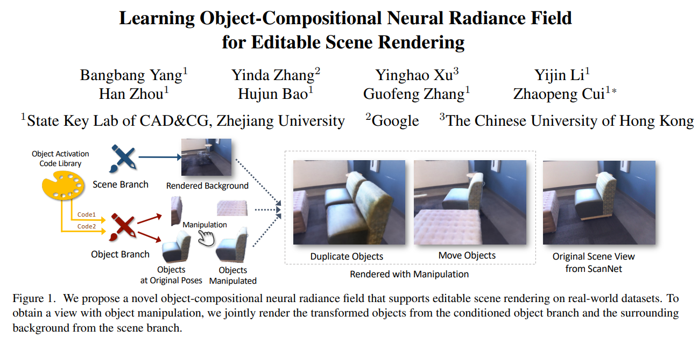

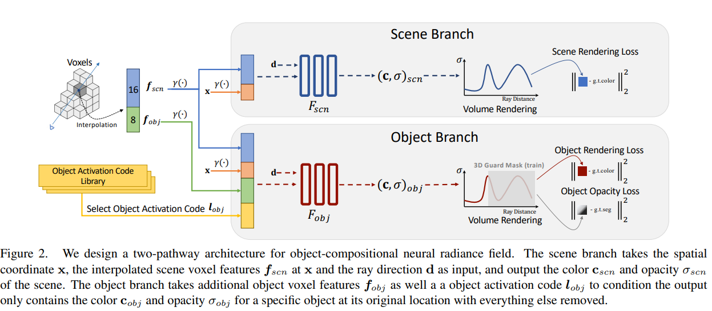

---

[12] KiloNeRF: Speeding up Neural Radiance Fields with Thousands of Tiny MLPs

- Title：KiloNeRF：使用数千个微型MLP加速神经辐射场

- Category：加速

- Project: none

- Code: https://github.com/creiser/kilonerf/

- Paper: https://arxiv.org/pdf/2103.13744.pdf

- Abstract：

  > *NeRF synthesizes novel views of a scene with unprecedented quality by fitting a neural radiance field to RGB images. However, NeRF requires querying a deep Multi-Layer Perceptron (MLP) millions of times, leading to slow rendering times, even on modern GPUs. In this paper, we demonstrate that real-time rendering is possible by utilizing thousands of tiny MLPs instead of one single large MLP. In our setting, each individual MLP only needs to represent parts of the scene, thus smaller and faster-to-evaluate MLPs can be used. By combining this divide-and-conquer strategy with further optimizations, rendering is accelerated by three orders of magnitude compared to the original NeRF model without incurring high storage costs. Further, using teacher-student distillation for training, we show that this speed-up can be achieved without sacrificing visual quality.*

- Figure：

---

[13] CodeNeRF: Disentangled Neural Radiance Fields for Object Categories

- Title：CodeNeRF：对象类别的解缠神经辐射场

- Category：可泛化

- Project: https://sites.google.com/view/wbjang/home/codenerf

- Code: https://github.com/wbjang/code-nerf

- Paper: https://arxiv.org/pdf/2109.01750.pdf

- Abstract：

  > *CodeNeRF is an implicit 3D neural representation that learns the variation of object shapes and textures across a category and can be trained, from a set of posed images, to synthesize novel views of unseen objects. Unlike the original NeRF, which is scene specific, CodeNeRF learns to disentangle shape and texture by learning separate embeddings. At test time, given a single unposed image of an unseen object, CodeNeRF jointly estimates camera viewpoint, and shape and appearance codes via optimization. Unseen objects can be reconstructed from a single image, and then rendered from new viewpoints or their shape and texture edited by varying the latent codes. We conduct experiments on the SRN benchmark, which show that CodeNeRF generalises well to unseen objects and achieves on-par performance with methods that require known camera pose at test time. Our results on real-world images demonstrate that CodeNeRF can bridge the sim-to-real gap. Project page: \url{[this https URL](https://github.com/wayne1123/code-nerf)}*

- Figure：

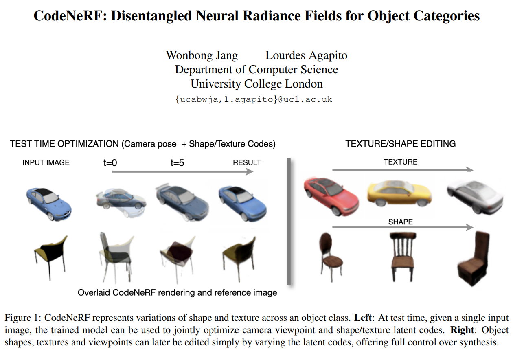

---

[14] Baking Neural Radiance Fields for Real-Time View Synthesis

- Title：为实时视图合成烘焙神经辐射场

- Category：快速渲染

- Project: https://phog.github.io/snerg/

- Code: https://github.com/google-research/google-research/tree/master/snerg

- Paper: https://arxiv.org/pdf/2103.14645.pdf

- Abstract：

  > *Neural volumetric representations such as Neural Radiance Fields (NeRF) have emerged as a compelling technique for learning to represent 3D scenes from images with the goal of rendering photorealistic images of the scene from unobserved viewpoints. However, NeRF's computational requirements are prohibitive for real-time applications: rendering views from a trained NeRF requires querying a multilayer perceptron (MLP) hundreds of times per ray. We present a method to train a NeRF, then precompute and store (i.e. "bake") it as a novel representation called a Sparse Neural Radiance Grid (SNeRG) that enables real-time rendering on commodity hardware. To achieve this, we introduce 1) a reformulation of NeRF's architecture, and 2) a sparse voxel grid representation with learned feature vectors. The resulting scene representation retains NeRF's ability to render fine geometric details and view-dependent appearance, is compact (averaging less than 90 MB per scene), and can be rendered in real-time (higher than 30 frames per second on a laptop GPU). Actual screen captures are shown in our video.*

- Figure：

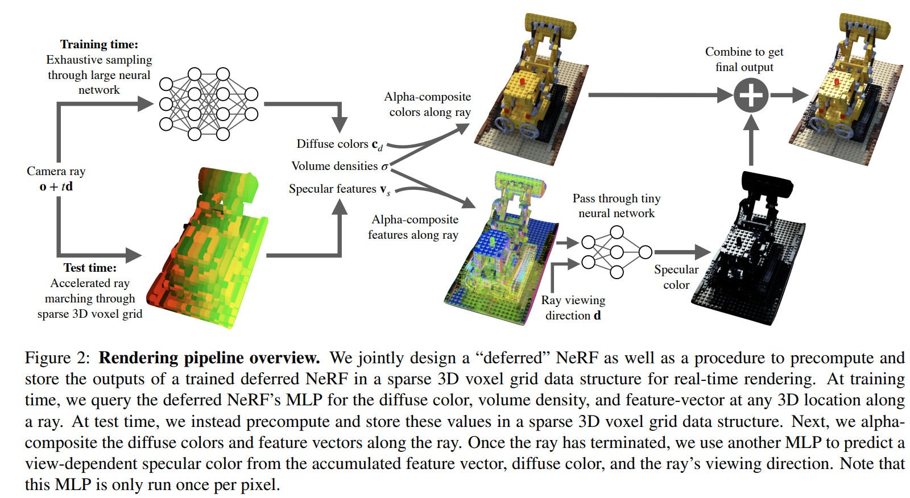

---

[15] MVSNeRF: Fast Generalizable Radiance Field Reconstruction from Multi-View Stereo

- Title：MVSNeRF：从多视图立体中快速泛化辐射场重建

- Category：稀疏视图,快速推理,MVS

- Project: https://apchenstu.github.io/mvsnerf/

- Code: https://github.com/apchenstu/mvsnerf

- Paper: https://arxiv.org/pdf/2103.15595.pdf

- Abstract：

  > *We present MVSNeRF, a novel neural rendering approach that can efficiently reconstruct neural radiance fields for view synthesis. Unlike prior works on neural radiance fields that consider per-scene optimization on densely captured images, we propose a generic deep neural network that can reconstruct radiance fields from only three nearby input views via fast network inference. Our approach leverages plane-swept cost volumes (widely used in multi-view stereo) for geometry-aware scene reasoning, and combines this with physically based volume rendering for neural radiance field reconstruction. We train our network on real objects in the DTU dataset, and test it on three different datasets to evaluate its effectiveness and generalizability. Our approach can generalize across scenes (even indoor scenes, completely different from our training scenes of objects) and generate realistic view synthesis results using only three input images, significantly outperforming concurrent works on generalizable radiance field reconstruction. Moreover, if dense images are captured, our estimated radiance field representation can be easily fine-tuned; this leads to fast per-scene reconstruction with higher rendering quality and substantially less optimization time than NeRF.*

- Figure：

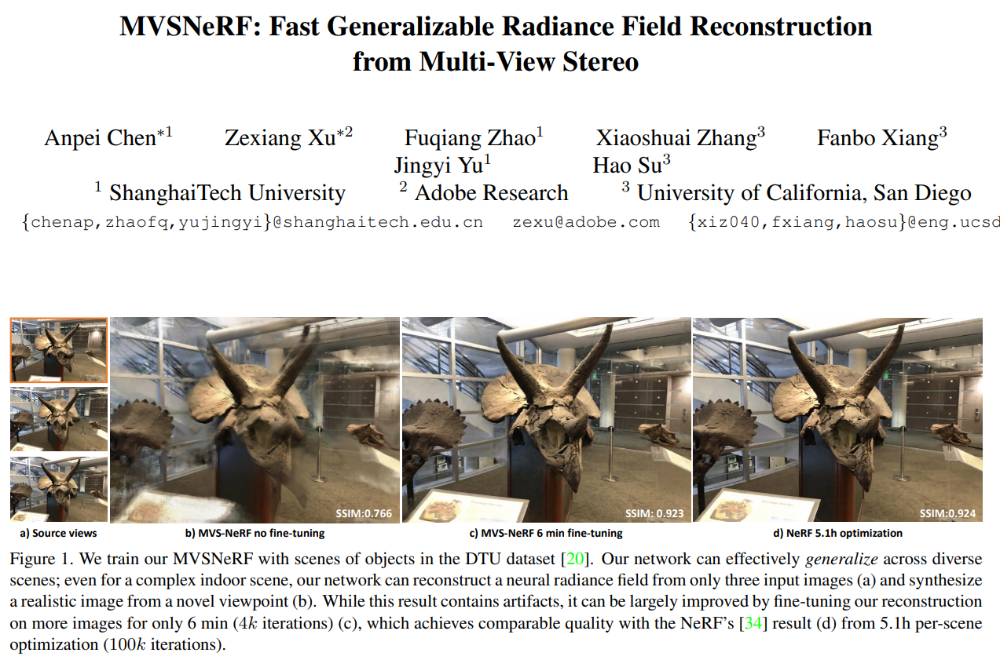

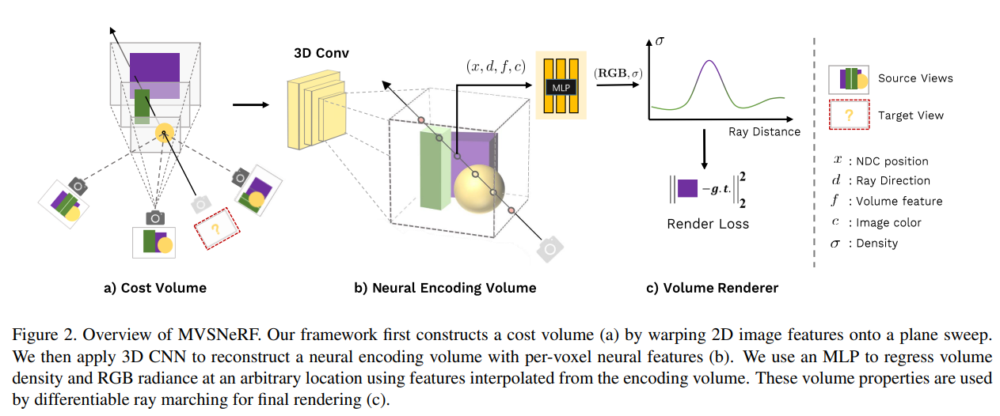

---

[16] NerfingMVS: Guided Optimization of Neural Radiance Fields for Indoor Multi-view Stereo

- Title：NerfingMVS：室内多视角立体神经辐射场的引导优化

- Category：MVS,深度监督

- Project: https://weiyithu.github.io/NerfingMVS/

- Code: https://github.com/weiyithu/NerfingMVS

- Paper: https://arxiv.org/pdf/2109.01129.pdf

- Abstract：

  > *In this work, we present a new multi-view depth estimation method that utilizes both conventional reconstruction and learning-based priors over the recently proposed neural radiance fields (NeRF). Unlike existing neural network based optimization method that relies on estimated correspondences, our method directly optimizes over implicit volumes, eliminating the challenging step of matching pixels in indoor scenes. The key to our approach is to utilize the learning-based priors to guide the optimization process of NeRF. Our system firstly adapts a monocular depth network over the target scene by finetuning on its sparse SfM+MVS reconstruction from COLMAP. Then, we show that the shape-radiance ambiguity of NeRF still exists in indoor environments and propose to address the issue by employing the adapted depth priors to monitor the sampling process of volume rendering. Finally, a per-pixel confidence map acquired by error computation on the rendered image can be used to further improve the depth quality. Experiments show that our proposed framework significantly outperforms state-of-the-art methods on indoor scenes, with surprising findings presented on the effectiveness of correspondence-based optimization and NeRF-based optimization over the adapted depth priors. In addition, we show that the guided optimization scheme does not sacrifice the original synthesis capability of neural radiance fields, improving the rendering quality on both seen and novel views. Code is available at [this https URL](https://github.com/weiyithu/NerfingMVS).*

- Figure：

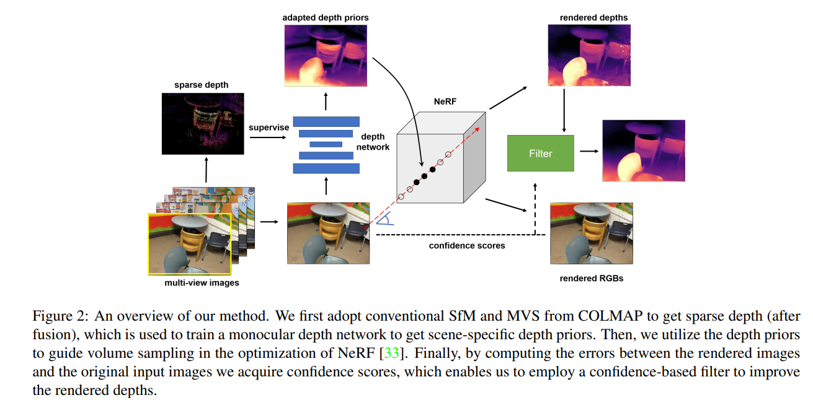

---

[17] Non-Rigid Neural Radiance Fields: Reconstruction and Novel View Synthesis of a Dynamic Scene From Monocular Video

- Title：非刚性神经辐射场：单目视频动态场景的重建和新视图合成

- Category：动态场景

- Project: https://vcai.mpi-inf.mpg.de/projects/nonrigid_nerf/

- Code: https://github.com/facebookresearch/nonrigid_nerf

- Paper: https://arxiv.org/pdf/2012.12247.pdf

- Abstract：

  > *We present Non-Rigid Neural Radiance Fields (NR-NeRF), a reconstruction and novel view synthesis approach for general non-rigid dynamic scenes. Our approach takes RGB images of a dynamic scene as input (e.g., from a monocular video recording), and creates a high-quality space-time geometry and appearance representation. We show that a single handheld consumer-grade camera is sufficient to synthesize sophisticated renderings of a dynamic scene from novel virtual camera views, e.g. a `bullet-time' video effect. NR-NeRF disentangles the dynamic scene into a canonical volume and its deformation. Scene deformation is implemented as ray bending, where straight rays are deformed non-rigidly. We also propose a novel rigidity network to better constrain rigid regions of the scene, leading to more stable results. The ray bending and rigidity network are trained without explicit supervision. Our formulation enables dense correspondence estimation across views and time, and compelling video editing applications such as motion exaggeration. Our code will be open sourced.*

- Figure：

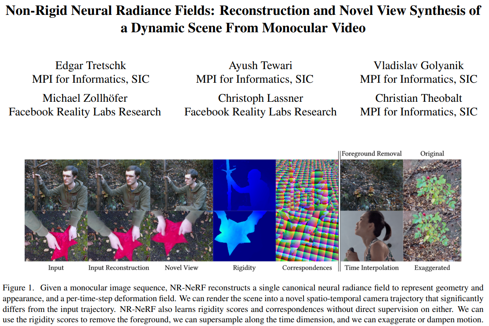

---

[18] Mip-NeRF: A Multiscale Representation for Anti-Aliasing Neural Radiance Fields

- Title：Mip-NeRF：抗锯齿神经辐射场的多尺度表示

- Category：抗锯齿,加速,位置编码

- Project: none

- Code: https://github.com/google/mipnerf

- Paper: https://arxiv.org/pdf/2103.13415.pdf

- Abstract：

  > *The rendering procedure used by neural radiance fields (NeRF) samples a scene with a single ray per pixel and may therefore produce renderings that are excessively blurred or aliased when training or testing images observe scene content at different resolutions. The straightforward solution of supersampling by rendering with multiple rays per pixel is impractical for NeRF, because rendering each ray requires querying a multilayer perceptron hundreds of times. Our solution, which we call "mip-NeRF" (a la "mipmap"), extends NeRF to represent the scene at a continuously-valued scale. By efficiently rendering anti-aliased conical frustums instead of rays, mip-NeRF reduces objectionable aliasing artifacts and significantly improves NeRF's ability to represent fine details, while also being 7% faster than NeRF and half the size. Compared to NeRF, mip-NeRF reduces average error rates by 17% on the dataset presented with NeRF and by 60% on a challenging multiscale variant of that dataset that we present. Mip-NeRF is also able to match the accuracy of a brute-force supersampled NeRF on our multiscale dataset while being 22x faster.*

- Figure：

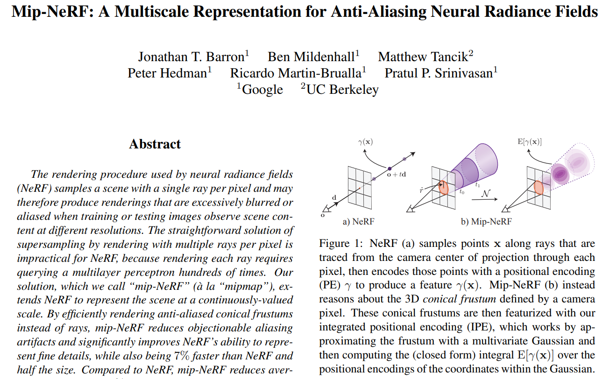

---

[19] Self-Calibrating Neural Radiance Fields

- Title：自标定神经辐射场

- Category：无位姿,相机自标定

- Project: https://postech-cvlab.github.io/SCNeRF/

- Code: https://github.com/POSTECH-CVLab/SCNeRF

- Paper: https://arxiv.org/pdf/2108.13826.pdf

- Abstract：

  > *In this work, we propose a camera self-calibration algorithm for generic cameras with arbitrary non-linear distortions. We jointly learn the geometry of the scene and the accurate camera parameters without any calibration objects. Our camera model consists of a pinhole model, a fourth order radial distortion, and a generic noise model that can learn arbitrary non-linear camera distortions. While traditional self-calibration algorithms mostly rely on geometric constraints, we additionally incorporate photometric consistency. This requires learning the geometry of the scene, and we use Neural Radiance Fields (NeRF). We also propose a new geometric loss function, viz., projected ray distance loss, to incorporate geometric consistency for complex non-linear camera models. We validate our approach on standard real image datasets and demonstrate that our model can learn the camera intrinsics and extrinsics (pose) from scratch without COLMAP initialization. Also, we show that learning accurate camera models in a differentiable manner allows us to improve PSNR over baselines. Our module is an easy-to-use plugin that can be applied to NeRF variants to improve performance. The code and data are currently available at [this https URL](https://github.com/POSTECH-CVLab/SCNeRF).*

- Figure：

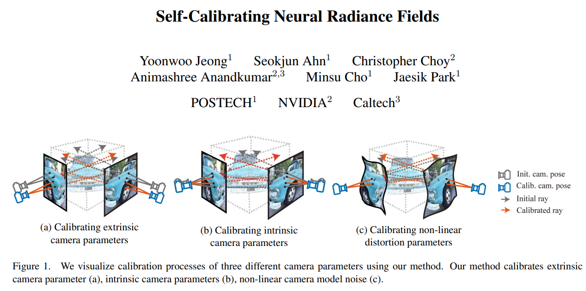

---

[20] Nerfies: Deformable Neural Radiance Fields

- Title：Nerfies：可变形神经辐射场

- Category：可变形

- Project: https://nerfies.github.io/

- Code: https://github.com/google/nerfies

- Paper: https://arxiv.org/pdf/2011.12948.pdf

- Abstract：

  > *We present the first method capable of photorealistically reconstructing deformable scenes using photos/videos captured casually from mobile phones. Our approach augments neural radiance fields (NeRF) by optimizing an additional continuous volumetric deformation field that warps each observed point into a canonical 5D NeRF. We observe that these NeRF-like deformation fields are prone to local minima, and propose a coarse-to-fine optimization method for coordinate-based models that allows for more robust optimization. By adapting principles from geometry processing and physical simulation to NeRF-like models, we propose an elastic regularization of the deformation field that further improves robustness. We show that our method can turn casually captured selfie photos/videos into deformable NeRF models that allow for photorealistic renderings of the subject from arbitrary viewpoints, which we dub "nerfies." We evaluate our method by collecting time-synchronized data using a rig with two mobile phones, yielding train/validation images of the same pose at different viewpoints. We show that our method faithfully reconstructs non-rigidly deforming scenes and reproduces unseen views with high fidelity.*

- Figure：

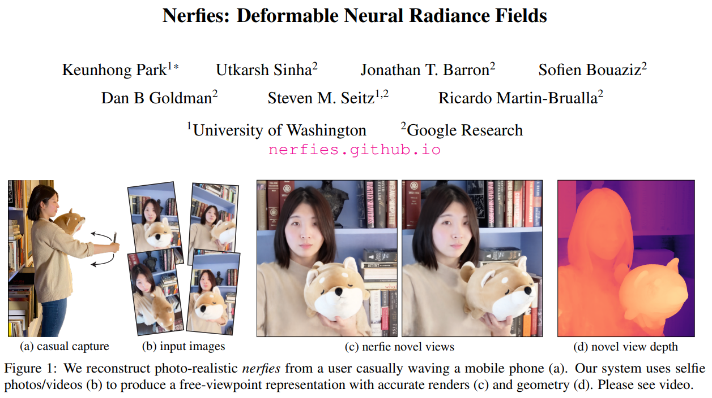

---

[21] UNISURF: Unifying Neural Implicit Surfaces and Radiance Fields for Multi-View Reconstruction

- Title：UNISURF：统一神经隐式表面和辐射场以进行多视图重建

- Category：渲染策略优化

- Project: https://moechsle.github.io/unisurf/

- Code: https://github.com/autonomousvision/unisurf

- Paper: https://arxiv.org/pdf/2104.10078.pdf

- Abstract：

  > *Neural implicit 3D representations have emerged as a powerful paradigm for reconstructing surfaces from multi-view images and synthesizing novel views. Unfortunately, existing methods such as DVR or IDR require accurate per-pixel object masks as supervision. At the same time, neural radiance fields have revolutionized novel view synthesis. However, NeRF's estimated volume density does not admit accurate surface reconstruction. Our key insight is that implicit surface models and radiance fields can be formulated in a unified way, enabling both surface and volume rendering using the same model. This unified perspective enables novel, more efficient sampling procedures and the ability to reconstruct accurate surfaces without input masks. We compare our method on the DTU, BlendedMVS, and a synthetic indoor dataset. Our experiments demonstrate that we outperform NeRF in terms of reconstruction quality while performing on par with IDR without requiring masks.*

- Figure：

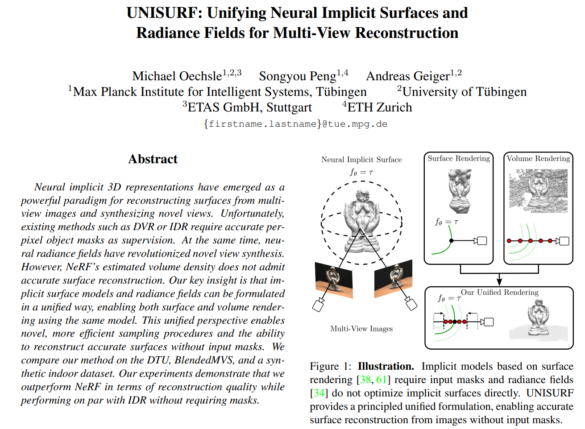

---

[22] Putting NeRF on a Diet: Semantically Consistent Few-Shot View Synthesis

- Title： DietNeRF：语义一致的少镜头视图合成

- Category：NeRF-CLIP,稀疏视图

- Project: https://www.ajayj.com/dietnerf

- Code: https://github.com/ajayjain/DietNeRF

- Paper: https://arxiv.org/pdf/2104.00677.pdf

- Abstract：

  > *We present DietNeRF, a 3D neural scene representation estimated from a few images. Neural Radiance Fields (NeRF) learn a continuous volumetric representation of a scene through multi-view consistency, and can be rendered from novel viewpoints by ray casting. While NeRF has an impressive ability to reconstruct geometry and fine details given many images, up to 100 for challenging 360° scenes, it often finds a degenerate solution to its image reconstruction objective when only a few input views are available. To improve few-shot quality, we propose DietNeRF. We introduce an auxiliary semantic consistency loss that encourages realistic renderings at novel poses. DietNeRF is trained on individual scenes to (1) correctly render given input views from the same pose, and (2) match high-level semantic attributes across different, random poses. Our semantic loss allows us to supervise DietNeRF from arbitrary poses. We extract these semantics using a pre-trained visual encoder such as CLIP, a Vision Transformer trained on hundreds of millions of diverse single-view, 2D photographs mined from the web with natural language supervision. In experiments, DietNeRF improves the perceptual quality of few-shot view synthesis when learned from scratch, can render novel views with as few as one observed image when pre-trained on a multi-view dataset, and produces plausible completions of completely unobserved regions.*

- Figure：

---

[23] MINE: Towards Continuous Depth MPI with NeRF for Novel View Synthesis

- Title：MINE：使用NeRF实现连续深度MPI以实现新视图合成

- Category：单视图

- Project: https://vincentfung13.github.io/projects/mine/

- Code: https://github.com/vincentfung13/MINE

- Paper: https://arxiv.org/pdf/2103.14910.pdf

- Abstract：

  > *In this paper, we propose MINE to perform novel view synthesis and depth estimation via dense 3D reconstruction from a single image. Our approach is a continuous depth generalization of the Multiplane Images (MPI) by introducing the NEural radiance fields (NeRF). Given a single image as input, MINE predicts a 4-channel image (RGB and volume density) at arbitrary depth values to jointly reconstruct the camera frustum and fill in occluded contents. The reconstructed and inpainted frustum can then be easily rendered into novel RGB or depth views using differentiable rendering. Extensive experiments on RealEstate10K, KITTI and Flowers Light Fields show that our MINE outperforms state-of-the-art by a large margin in novel view synthesis. We also achieve competitive results in depth estimation on iBims-1 and NYU-v2 without annotated depth supervision. Our source code is available at [this https URL](https://github.com/vincentfung13/MINE)*

- Figure：

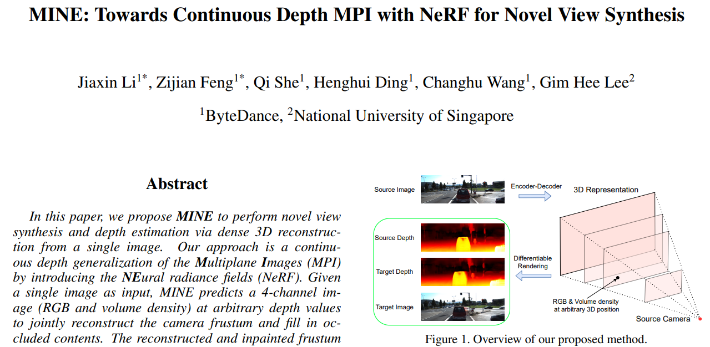

---

[24] 

- Title：

- Category：

- Project: 

- Code: 

- Paper: 

- Abstract：

  > **

- Figure：

---

[] 

- Title：

- Category：

- Project: 

- Code: 

- Paper: 

- Abstract：

  > **

- Figure：

