# NeRFs-NIPS

> - 当前论文数：17
> - [NeRFs-NIPS2020](#NeRFs-NIPS2020) : 1
>
> - [NeRFs-NIPS2021](#NeRFs-NIPS2021) : 4
> - [NeRFs-NIPS2022](#NeRFs-NIPS2022) : 12

## NeRFs-NIPS2020

---

[1] GRAF: Generative Radiance Fields for 3D-Aware Image Synthesis 

- Title：GRAF：用于3D感知图像合成的生成辐射场

- Category：NeRF-GAN

- Project: none

- Code: https://github.com/autonomousvision/graf

- Paper: [pdf](https://papers.nips.cc/paper_files/paper/2020/file/e92e1b476bb5262d793fd40931e0ed53-Paper.pdf)

- Abstract：

  > *While 2D generative adversarial networks have enabled high-resolution image synthesis, they largely lack an understanding of the 3D world and the image formation process. Thus, they do not provide precise control over camera viewpoint or object pose. To address this problem, several recent approaches leverage intermediate voxel-based representations in combination with differentiable rendering. However, existing methods either produce low image resolution or fall short in disentangling camera and scene properties, e.g., the object identity may vary with the viewpoint. In this paper, we propose a generative model for radiance fields which have recently proven successful for novel view synthesis of a single scene. In contrast to voxel-based representations, radiance fields are not confined to a coarse discretization of the 3D space, yet allow for disentangling camera and scene properties while degrading gracefully in the presence of reconstruction ambiguity. By introducing a multi-scale patch-based discriminator, we demonstrate synthesis of high-resolution images while training our model from unposed 2D images alone. We systematically analyze our approach on several challenging synthetic and real-world datasets. Our experiments reveal that radiance fields are a powerful representation for generative image synthesis, leading to 3D consistent models that render with high fidelity.*

- Figure：

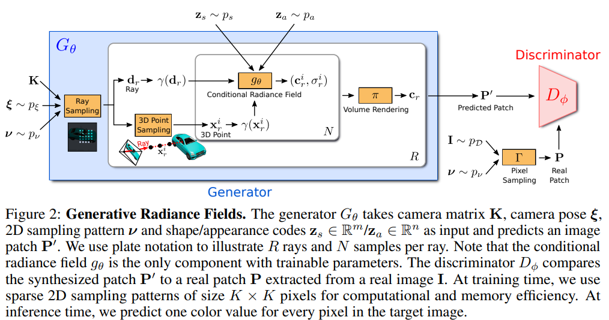

## NeRFs-NIPS2021

> - 当前论文数：4
> - 收集来源：[NeRF-NIPS2021](https://proceedings.neurips.cc/paper/2021)   Search: “nerf” OR “radiance” OR “slam”

---

[1] H-NeRF: Neural Radiance Fields for Rendering and Temporal Reconstruction of Humans in Motion 

- Title：H-NeRF：用于运动中人体渲染和时间重建的神经辐射场

- Category：人体动态建模

- Project: none

- Code: none

- Paper: https://arxiv.org/pdf/2110.13746.pdf

- Abstract：

  > *We present neural radiance fields for rendering and temporal (4D) reconstruction of humans in motion (H-NeRF), as captured by a sparse set of cameras or even from a monocular video. Our approach combines ideas from neural scene representation, novel-view synthesis, and implicit statistical geometric human representations, coupled using novel loss functions. Instead of learning a radiance field with a uniform occupancy prior, we constrain it by a structured implicit human body model, represented using signed distance functions. This allows us to robustly fuse information from sparse views and generalize well beyond the poses or views observed in training. Moreover, we apply geometric constraints to co-learn the structure of the observed subject -- including both body and clothing -- and to regularize the radiance field to geometrically plausible solutions. Extensive experiments on multiple datasets demonstrate the robustness and the accuracy of our approach, its generalization capabilities significantly outside a small training set of poses and views, and statistical extrapolation beyond the observed shape.*

- Figure：

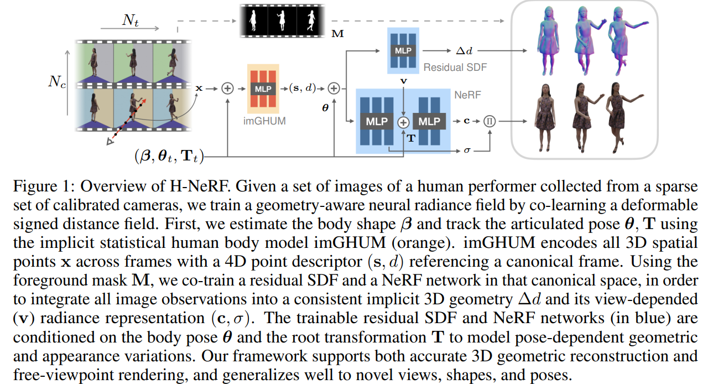

---

[2] A-NeRF: Articulated Neural Radiance Fields for Learning Human Shape, Appearance, and Pose

- Title：A-NeRF：用于学习人体形状、外观和姿势的铰接式神经辐射场

- Category：人体动态建模

- Project: https://lemonatsu.github.io/anerf/

- Code: https://github.com/LemonATsu/A-NeRF

- Paper: https://arxiv.org/pdf/2102.06199.pdf

- Abstract：

  > *While deep learning reshaped the classical motion capture pipeline with feed-forward networks, generative models are required to recover fine alignment via iterative refinement. Unfortunately, the existing models are usually hand-crafted or learned in controlled conditions, only applicable to limited domains. We propose a method to learn a generative neural body model from unlabelled monocular videos by extending Neural Radiance Fields (NeRFs). We equip them with a skeleton to apply to time-varying and articulated motion. A key insight is that implicit models require the inverse of the forward kinematics used in explicit surface models. Our reparameterization defines spatial latent variables relative to the pose of body parts and thereby overcomes ill-posed inverse operations with an overparameterization. This enables learning volumetric body shape and appearance from scratch while jointly refining the articulated pose; all without ground truth labels for appearance, pose, or 3D shape on the input videos. When used for novel-view-synthesis and motion capture, our neural model improves accuracy on diverse datasets. Project website: [this https URL](https://lemonatsu.github.io/anerf/) .*

- Figure：

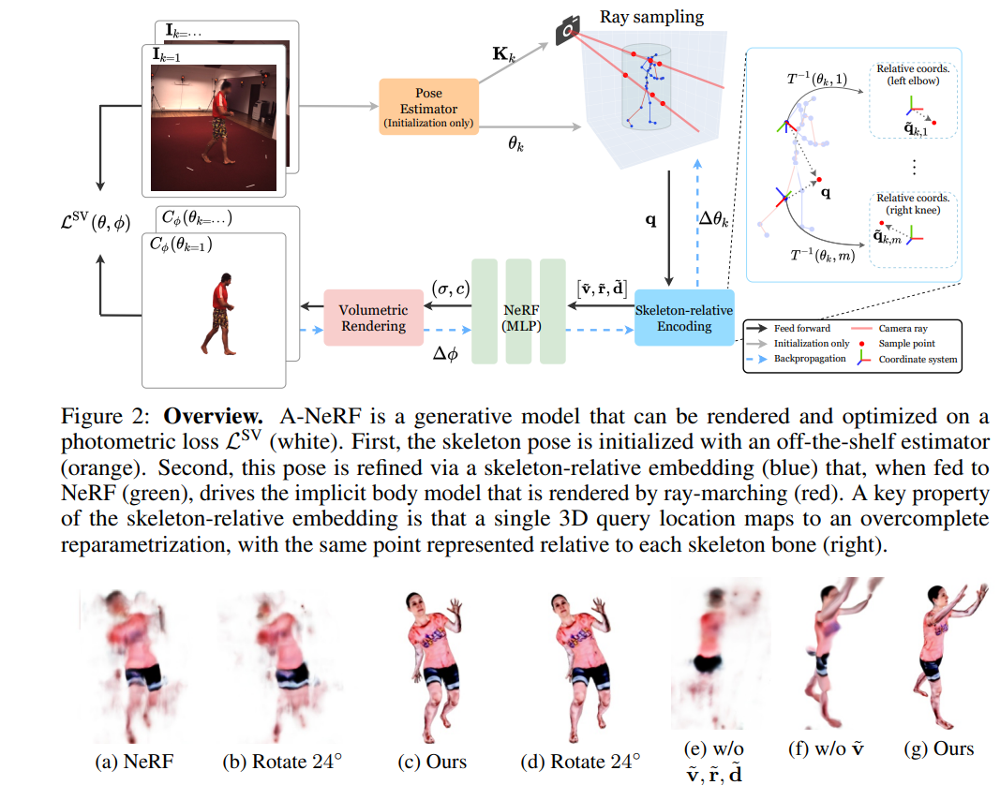

---

[3] Neural Human Performer: Learning Generalizable Radiance Fields for Human Performance Rendering

- Title：神经人类表演者：学习人类表演渲染的可推广辐射场

- Category：人体动态建模

- Project: https://youngjoongunc.github.io/nhp/

- Code: https://github.com/YoungJoongUNC/Neural_Human_Performer

- Paper: https://arxiv.org/pdf/2109.07448.pdf

- Abstract：

  > *In this paper, we aim at synthesizing a free-viewpoint video of an arbitrary human performance using sparse multi-view cameras. Recently, several works have addressed this problem by learning person-specific neural radiance fields (NeRF) to capture the appearance of a particular human. In parallel, some work proposed to use pixel-aligned features to generalize radiance fields to arbitrary new scenes and objects. Adopting such generalization approaches to humans, however, is highly challenging due to the heavy occlusions and dynamic articulations of body parts. To tackle this, we propose Neural Human Performer, a novel approach that learns generalizable neural radiance fields based on a parametric human body model for robust performance capture. Specifically, we first introduce a temporal transformer that aggregates tracked visual features based on the skeletal body motion over time. Moreover, a multi-view transformer is proposed to perform cross-attention between the temporally-fused features and the pixel-aligned features at each time step to integrate observations on the fly from multiple views. Experiments on the ZJU-MoCap and AIST datasets show that our method significantly outperforms recent generalizable NeRF methods on unseen identities and poses. The video results and code are available at [this https URL](https://youngjoongunc.github.io/nhp).*

- Figure：

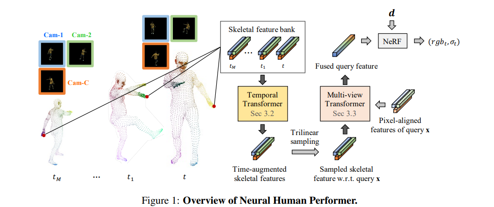

---

[4] TöRF: Time-of-Flight Radiance Fields for Dynamic Scene View Synthesis

- Title：TöRF：用于动态场景视图合成的飞行时间辐射场

- Category：动态场景

- Project: https://imaging.cs.cmu.edu/torf/

- Code: https://github.com/breuckelen/torf

- Paper: https://arxiv.org/pdf/2109.15271.pdf

- Abstract：

  > *Neural networks can represent and accurately reconstruct radiance fields for static 3D scenes (e.g., NeRF). Several works extend these to dynamic scenes captured with monocular video, with promising performance. However, the monocular setting is known to be an under-constrained problem, and so methods rely on data-driven priors for reconstructing dynamic content. We replace these priors with measurements from a time-of-flight (ToF) camera, and introduce a neural representation based on an image formation model for continuous-wave ToF cameras. Instead of working with processed depth maps, we model the raw ToF sensor measurements to improve reconstruction quality and avoid issues with low reflectance regions, multi-path interference, and a sensor's limited unambiguous depth range. We show that this approach improves robustness of dynamic scene reconstruction to erroneous calibration and large motions, and discuss the benefits and limitations of integrating RGB+ToF sensors that are now available on modern smartphones.*

- Figure：

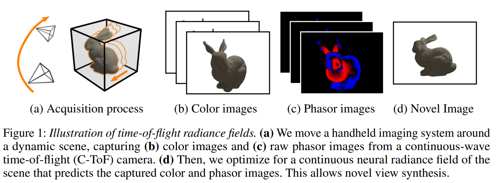

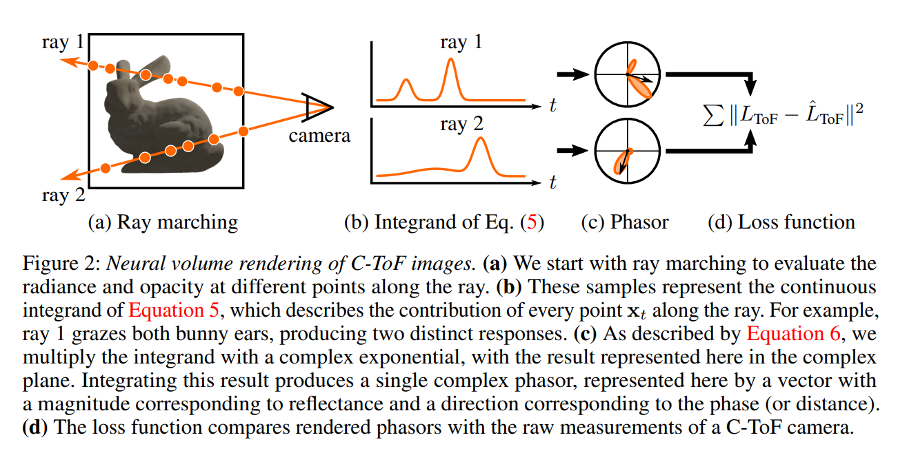

---

[] 

- Title：

- Category：

- Project: 

- Code: 

- Paper: 

- Abstract：

  > **

- Figure：

## NeRFs-NIPS2022

> - 当前论文数：12
> - 收集来源：[NIPS 2022 Papers](https://nips.cc/virtual/2022/papers.html?filter=titles)   Search: “nerf” OR “radiance” OR “slam”

---

[1] $D^2NeRF$: Self-Supervised Decoupling of Dynamic and Static Objects from a Monocular Video

- Title：$D^2NeRF$：单目视频中动态和静态对象的自监督解耦

- Category：动态场景

- Project: https://d2nerf.github.io/

- Code: https://github.com/ChikaYan/d2nerf

- Paper: https://arxiv.org/pdf/2205.15838.pdf

- Abstract：

  > *Given a monocular video, segmenting and decoupling dynamic objects while recovering the static environment is a widely studied problem in machine intelligence. Existing solutions usually approach this problem in the image domain, limiting their performance and understanding of the environment. We introduce Decoupled Dynamic Neural Radiance Field (D2NeRF), a self-supervised approach that takes a monocular video and learns a 3D scene representation which decouples moving objects, including their shadows, from the static background. Our method represents the moving objects and the static background by two separate neural radiance fields with only one allowing for temporal changes. A naive implementation of this approach leads to the dynamic component taking over the static one as the representation of the former is inherently more general and prone to overfitting. To this end, we propose a novel loss to promote correct separation of phenomena. We further propose a shadow field network to detect and decouple dynamically moving shadows. We introduce a new dataset containing various dynamic objects and shadows and demonstrate that our method can achieve better performance than state-of-the-art approaches in decoupling dynamic and static 3D objects, occlusion and shadow removal, and image segmentation for moving objects.*

- Figure：

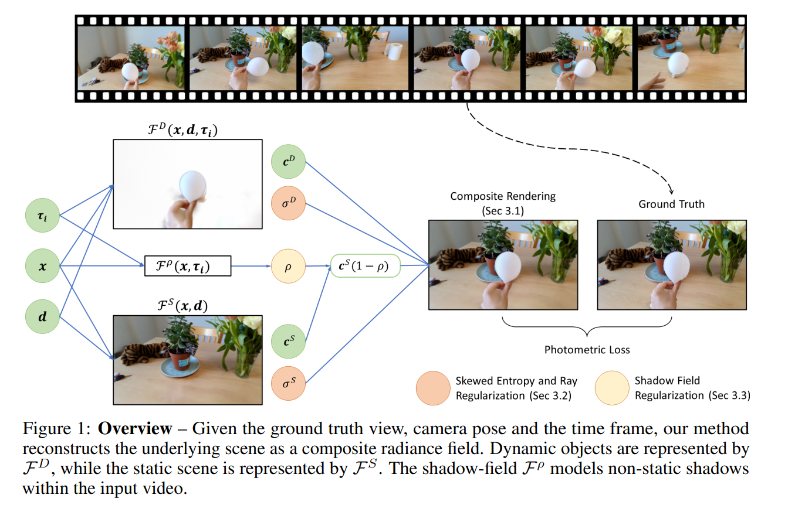

---

[2] CageNeRF: Cage-based Neural Radiance Field for Generalized 3D Deformation and Animation

- Title：CageNeRF：用于广义3D变形和动画的基于笼的神经辐射场

- Category：可变形

- Project: https://pengyicong.github.io/CageNeRF/

- Code: https://github.com/PengYicong/CageNeRF

- Paper: [pdf](https://proceedings.neurips.cc/paper_files/paper/2022/file/cb78e6b5246b03e0b82b4acc8b11cc21-Paper-Conference.pdf)

- Abstract：

  > *While implicit representations have achieved high-fidelity results in 3D rendering, it remains challenging to deforming and animating the implicit field. Existing works typically leverage data-dependent models as deformation priors, such as SMPL for human body animation. However, this dependency on category-specific priors limits them to generalize to other objects. To solve this problem, we propose a novel framework for deforming and animating the neural radiance field learned on \textit{arbitrary} objects. The key insight is that we introduce a cage-based representation as deformation prior, which is category-agnostic. Specifically, the deformation is performed based on an enclosing polygon mesh with sparsely defined vertices called \textit{cage} inside the rendering space, where each point is projected into a novel position based on the barycentric interpolation of the deformed cage vertices. In this way, we transform the cage into a generalized constraint, which is able to deform and animate arbitrary target objects while preserving geometry details. Based on extensive experiments, we demonstrate the effectiveness of our framework in the task of geometry editing, object animation and deformation transfer.*

- Figure：

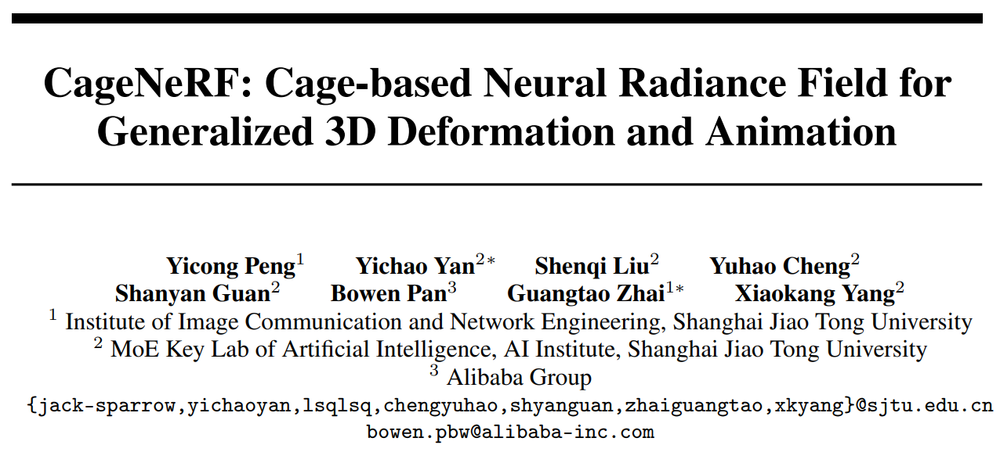

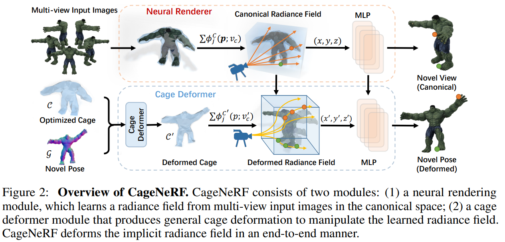

---

[3] Compressible-composable NeRF via Rank-residual Decomposition

- Title：通过秩残差分解的可压缩可组合NeRF

- Category：节省内存,模型压缩

- Project: https://me.kiui.moe/ccnerf/

- Code: https://github.com/ashawkey/CCNeRF

- Paper: [pdf](https://proceedings.neurips.cc/paper_files/paper/2022/file/5ed5c3c846f684a54975ad7a2525199f-Paper-Conference.pdf)

- Abstract：

  > *Neural Radiance Field (NeRF) has emerged as a compelling method to represent 3D objects and scenes for photo-realistic rendering. However, its implicit representation causes difficulty in manipulating the models like the explicit mesh representation.Several recent advances in NeRF manipulation are usually restricted by a shared renderer network, or suffer from large model size. To circumvent the hurdle, in this paper, we present a neural field representation that enables efficient and convenient manipulation of models.To achieve this goal, we learn a hybrid tensor rank decomposition of the scene without neural networks. Motivated by the low-rank approximation property of the SVD algorithm, we propose a rank-residual learning strategy to encourage the preservation of primary information in lower ranks. The model size can then be dynamically adjusted by rank truncation to control the levels of detail, achieving near-optimal compression without extra optimization.Furthermore, different models can be arbitrarily transformed and composed into one scene by concatenating along the rank dimension.The growth of storage cost can also be mitigated by compressing the unimportant objects in the composed scene. We demonstrate that our method is able to achieve comparable rendering quality to state-of-the-art methods, while enabling extra capability of compression and composition.Code is available at https://github.com/ashawkey/CCNeRF.*

- Figure：

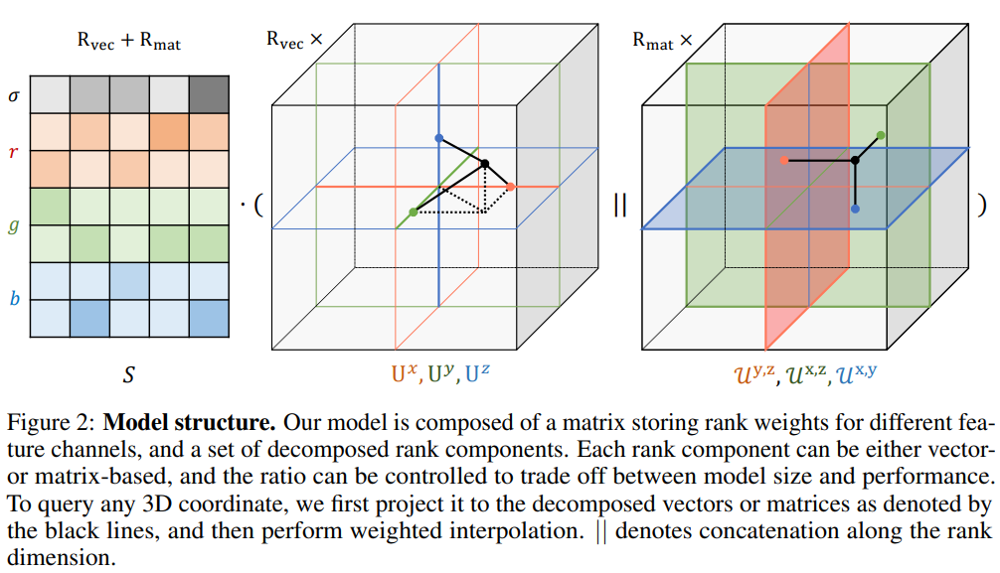

---

[4] $S^3$-NeRF: Neural Reflectance Field from Shading and Shadow under a Single Viewpoint

- Title：$S^3$-NeRF：单一视点下来自阴影和阴影的神经反射场

- Category：不同光照  [？？？]

- Project: https://ywq.github.io/s3nerf/

- Code: https://github.com/ywq/s3nerf

- Paper: [pdf](https://proceedings.neurips.cc/paper_files/paper/2022/file/0a630402ee92620dc2de3b704181de9b-Paper-Conference.pdf)

- Abstract：

  > *In this paper, we address the "dual problem" of multi-view scene reconstruction in which we utilize single-view images captured under different point lights to learn a neural scene representation. Different from existing single-view methods which can only recover a 2.5D scene representation (i.e., a normal / depth map for the visible surface), our method learns a neural reflectance field to represent the 3D geometry and BRDFs of a scene. Instead of relying on multi-view photo-consistency, our method exploits two information-rich monocular cues, namely shading and shadow, to infer scene geometry. Experiments on multiple challenging datasets show that our method is capable of recovering 3D geometry, including both visible and invisible parts, of a scene from single-view images. Thanks to the neural reflectance field representation, our method is robust to depth discontinuities. It supports applications like novel-view synthesis and relighting. Our code and model can be found at https://ywq.github.io/s3nerf.*

- Figure：

---

[5] Decomposing NeRF for Editing via Feature Field Distillation

- Title：通过特征域蒸馏分解NeRF进行编辑

- Category：特征域蒸馏,可编辑

- Project: https://pfnet-research.github.io/distilled-feature-fields/

- Code: https://github.com/pfnet-research/distilled-feature-fields

- Paper: https://arxiv.org/pdf/2205.15585.pdf

- Abstract：

  > *Emerging neural radiance fields (NeRF) are a promising scene representation for computer graphics, enabling high-quality 3D reconstruction and novel view synthesis from image observations.However, editing a scene represented by a NeRF is challenging, as the underlying connectionist representations such as MLPs or voxel grids are not object-centric or compositional.In particular, it has been difficult to selectively edit specific regions or objects.In this work, we tackle the problem of semantic scene decomposition of NeRFs to enable query-based local editing of the represented 3D scenes.We propose to distill the knowledge of off-the-shelf, self-supervised 2D image feature extractors such as CLIP-LSeg or DINO into a 3D feature field optimized in parallel to the radiance field.Given a user-specified query of various modalities such as text, an image patch, or a point-and-click selection, 3D feature fields semantically decompose 3D space without the need for re-training, and enables us to semantically select and edit regions in the radiance field.Our experiments validate that the distilled feature fields can transfer recent progress in 2D vision and language foundation models to 3D scene representations, enabling convincing 3D segmentation and selective editing of emerging neural graphics representations.*

- Figure：

---

[6] DeVRF: Fast Deformable Voxel Radiance Fields for Dynamic Scenes

- Title：DeVRF：动态场景的快速可变形体素辐射场

- Category：动态场景,加速

- Project: https://jia-wei-liu.github.io/DeVRF/

- Code: https://github.com/showlab/DeVRF

- Paper: [pdf](https://proceedings.neurips.cc/paper_files/paper/2022/file/eeb57fdf745eb31a3c7ef22c59a4661d-Paper-Conference.pdf)

- Abstract：

  > *Modeling dynamic scenes is important for many applications such as virtual reality and telepresence. Despite achieving unprecedented fidelity for novel view synthesis in dynamic scenes, existing methods based on Neural Radiance Fields (NeRF) suffer from slow convergence (i.e., model training time measured in days). In this paper, we present DeVRF, a novel representation to accelerate learning dynamic radiance fields. The core of DeVRF is to model both the 3D canonical space and 4D deformation field of a dynamic, non-rigid scene with explicit and discrete voxel-based representations. However, it is quite challenging to train such a representation which has a large number of model parameters, often resulting in overfitting issues. To overcome this challenge, we devise a novel static-to-dynamic learning paradigm together with a new data capture setup that is convenient to deploy in practice. This paradigm unlocks efficient learning of deformable radiance fields via utilizing the 3D volumetric canonical space learnt from multi-view static images to ease the learning of 4D voxel deformation field with only few-view dynamic sequences. To further improve the efficiency of our DeVRF and its synthesized novel view's quality, we conduct thorough explorations and identify a set of strategies. We evaluate DeVRF on both synthetic and real-world dynamic scenes with different types of deformation. Experiments demonstrate that DeVRF achieves two orders of magnitude speedup (**100× faster**) with on-par high-fidelity results compared to the previous state-of-the-art approaches. The code and dataset are released in https://github.com/showlab/DeVRF.*

- Figure：

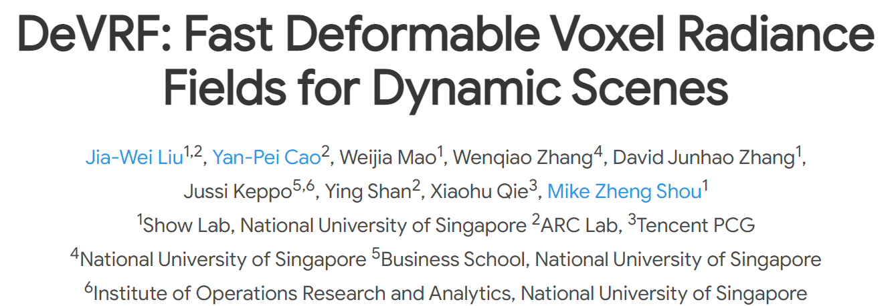

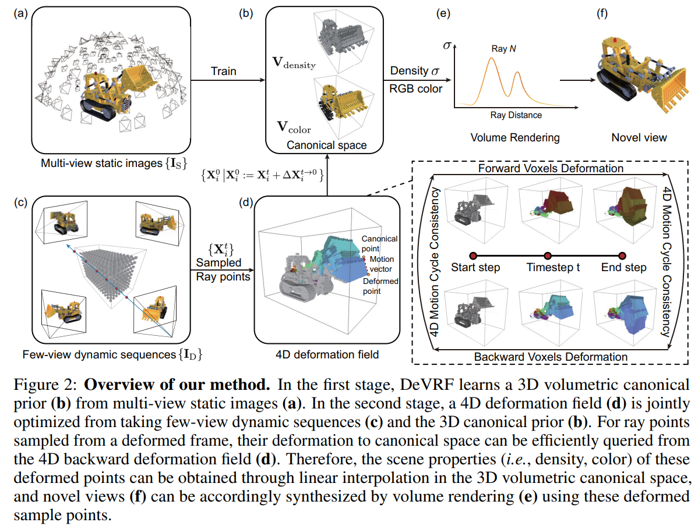

---

[7] Unsupervised Multi-View Object Segmentation Using Radiance Field Propagation

- Title：使用辐射场传播的无监督多视图对象分割

- Category：对象分割

- Project: https://xinhangliu.com/nerf_seg

- Code: https://github.com/DarlingHang/radiance_field_propagation

- Paper: [pdf](https://proceedings.neurips.cc/paper_files/paper/2022/file/70de9e3948645a1be2de657f14d85c6d-Paper-Conference.pdf)

- Abstract：

  > *We present radiance field propagation (RFP), a novel approach to segmenting objects in 3D during reconstruction given only unlabeled multi-view images of a scene. RFP is derived from emerging neural radiance field-based techniques, which jointly encodes semantics with appearance and geometry. The core of our method is a novel propagation strategy for individual objects' radiance fields with a bidirectional photometric loss, enabling an unsupervised partitioning of a scene into salient or meaningful regions corresponding to different object instances. To better handle complex scenes with multiple objects and occlusions, we further propose an iterative expectation-maximization algorithm to refine object masks. To the best of our knowledge, RFP is the first unsupervised approach for tackling 3D scene object segmentation for neural radiance field (NeRF) without any supervision, annotations, or other cues such as 3D bounding boxes and prior knowledge of object class. Experiments demonstrate that RFP achieves feasible segmentation results that are more accurate than previous unsupervised image/scene segmentation approaches, and are comparable to existing supervised NeRF-based methods. The segmented object representations enable individual 3D object editing operations. Codes and datasets will be made publicly available.*

- Figure：

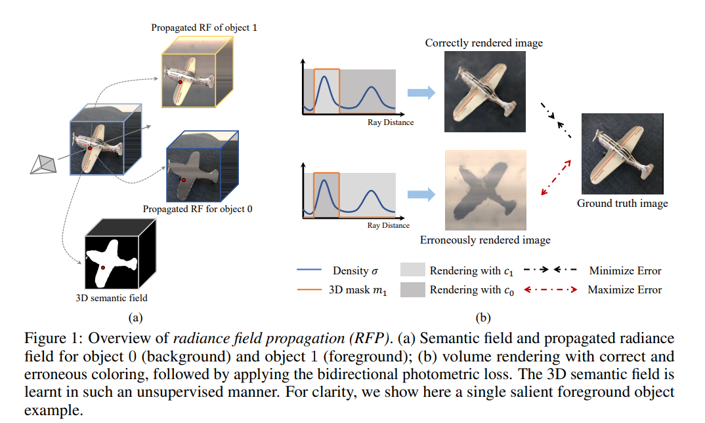

---

[8] Generative Neural Articulated Radiance Fields

- Title：生成神经关节辐射场

- Category：NeRF-GAN,人体建模

- Project: http://www.computationalimaging.org/publications/gnarf/

- Code: https://github.com/alexanderbergman7/GNARF

- Paper: [pdf](https://proceedings.neurips.cc/paper_files/paper/2022/file/7dbafa7d2051218f364c9a38ef1150de-Paper-Conference.pdf)

- Abstract：

  > *Unsupervised learning of 3D-aware generative adversarial networks (GANs) using only collections of single-view 2D photographs has very recently made much progress. These 3D GANs, however, have not been demonstrated for human bodies and the generated radiance fields of existing frameworks are not directly editable, limiting their applicability in downstream tasks. We propose a solution to these challenges by developing a 3D GAN framework that learns to generate radiance fields of human bodies or faces in a canonical pose and warp them using an explicit deformation field into a desired body pose or facial expression. Using our framework, we demonstrate the first high-quality radiance field generation results for human bodies. Moreover, we show that our deformation-aware training procedure significantly improves the quality of generated bodies or faces when editing their poses or facial expressions compared to a 3D GAN that is not trained with explicit deformations.*

- Figure：

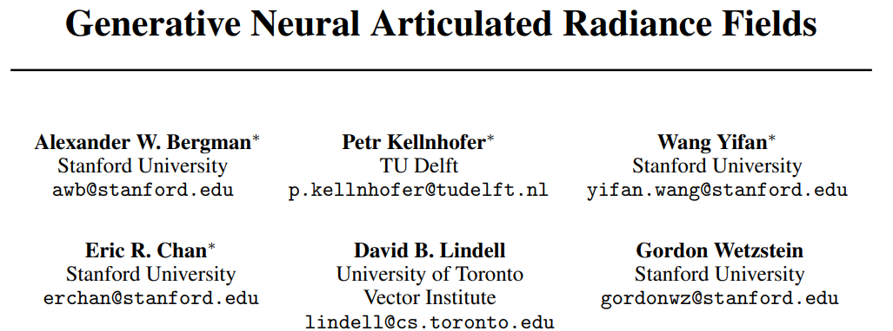

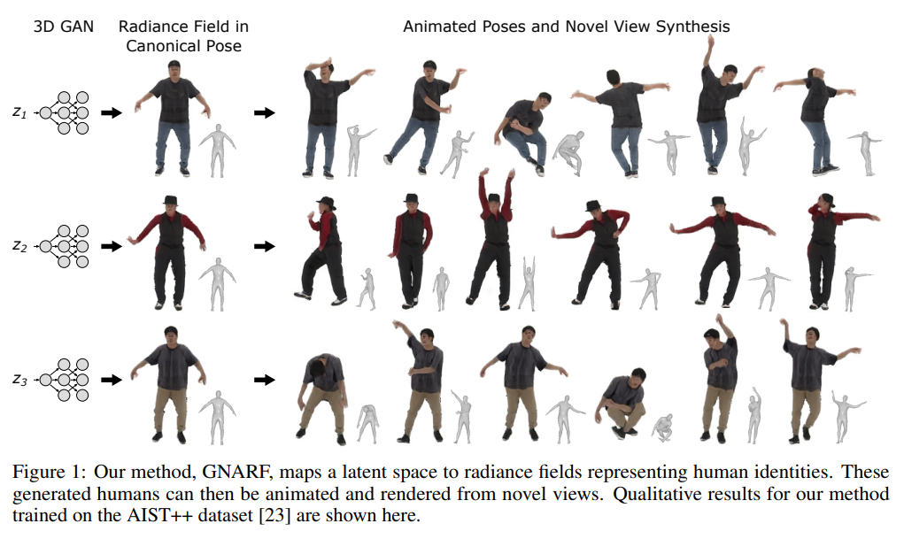

---

[9] Reinforcement Learning with Neural Radiance Fields

- Title：神经辐射场强化学习

- Category：强化学习,NeRF监督

- Project: https://dannydriess.github.io/nerf-rl/

- Code: none

- Paper: [pdf](https://proceedings.neurips.cc/paper_files/paper/2022/file/6c294f059e3d77d58dbb8fe48f21fe00-Paper-Conference.pdf)

- Abstract：

  > *It is a long-standing problem to find effective representations for training reinforcement learning (RL) agents. This paper demonstrates that learning state representations with supervision from Neural Radiance Fields (NeRFs) can improve the performance of RL compared to other learned representations or even low-dimensional, hand-engineered state information. Specifically, we propose to train an encoder that maps multiple image observations to a latent space describing the objects in the scene. The decoder built from a latent-conditioned NeRF serves as the supervision signal to learn the latent space. An RL algorithm then operates on the learned latent space as its state representation. We call this NeRF-RL. Our experiments indicate that NeRF as supervision leads to a latent space better suited for the downstream RL tasks involving robotic object manipulations like hanging mugs on hooks, pushing objects, or opening doors.Video: https://dannydriess.github.io/nerf-rl*

- Figure：

---

[10] Neural Transmitted Radiance Fields

- Title：神经透射辐射场

- Category：光照反射,稀疏视图

- Project: none

- Code: https://github.com/FreeButUselessSoul/TNeRF

- Paper: [pdf](https://proceedings.neurips.cc/paper_files/paper/2022/file/fe989bb038b5dcc44181255dd6913e43-Paper-Conference.pdf)

- Abstract：

  > *Neural radiance fields (NeRF) have brought tremendous progress to novel view synthesis. Though NeRF enables the rendering of subtle details in a scene by learning from a dense set of images, it also reconstructs the undesired reflections when we capture images through glass. As a commonly observed interference, the reflection would undermine the visibility of the desired transmitted scene behind glass by occluding the transmitted light rays. In this paper, we aim at addressing the problem of rendering novel transmitted views given a set of reflection-corrupted images. By introducing the transmission encoder and recurring edge constraints as guidance, our neural transmitted radiance fields can resist such reflection interference during rendering and reconstruct high-fidelity results even under sparse views. The proposed method achieves superior performance from the experiments on a newly collected dataset compared with state-of-the-art methods.*

- Figure：

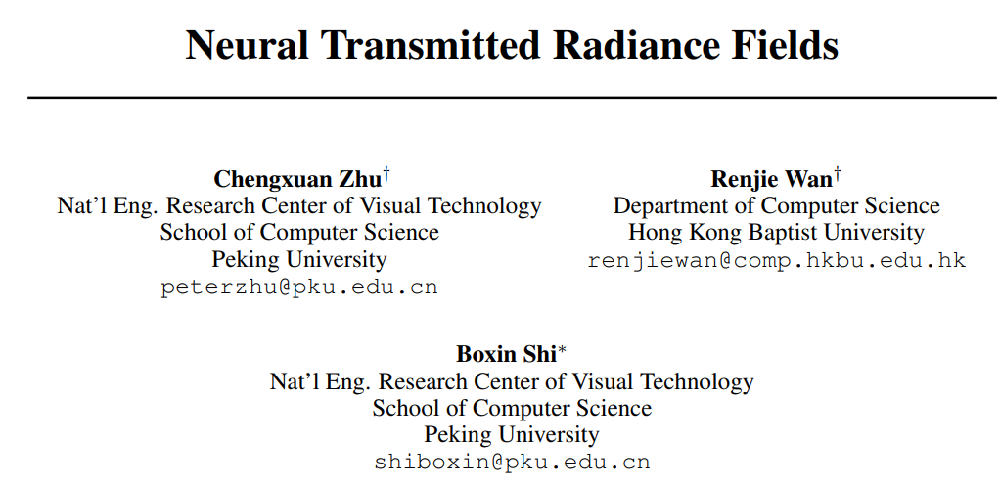

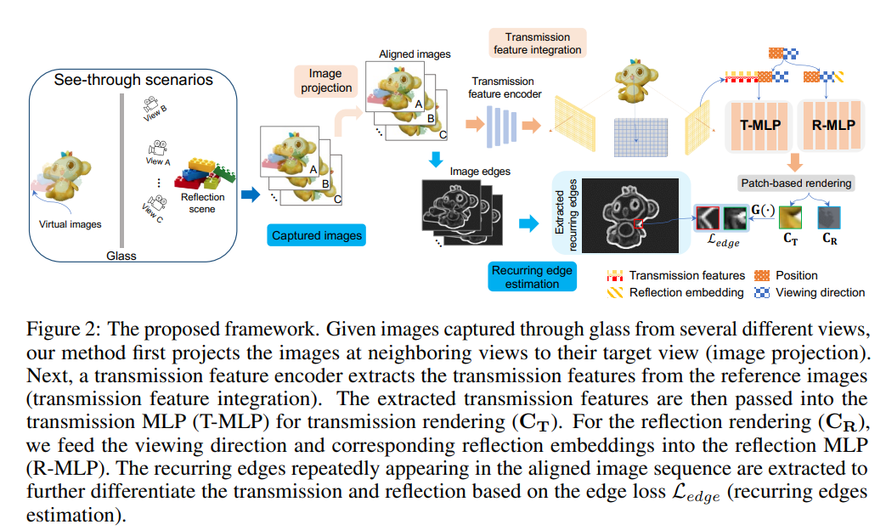

---

[11] Streaming Radiance Fields for 3D Video Synthesis

- Title：用于 3D 视频合成的流式辐射场

- Category：混合表示,加速,动态场景

- Project: none

- Code: https://github.com/AlgoHunt/StreamRF

- Paper: [pdf](https://proceedings.neurips.cc/paper_files/paper/2022/file/57c2cc952f388f6185db98f441351c96-Paper-Conference.pdf)

- Abstract：

  > *We present an explicit-grid based method for efficiently reconstructing streaming radiance fields for novel view synthesis of real world dynamic scenes. Instead of training a single model that combines all the frames, we formulate the dynamic modeling problem with an incremental learning paradigm in which per-frame model difference is trained to complement the adaption of a base model on the current frame. By exploiting the simple yet effective tuning strategy with narrow bands, the proposed method realizes a feasible framework for handling video sequences on-the-fly with high training efficiency. The storage overhead induced by using explicit grid representations can be significantly reduced through the use of model difference based compression. We also introduce an efficient strategy to further accelerate model optimization for each frame. Experiments on challenging video sequences demonstrate that our approach is capable of achieving a training speed of 15 seconds per-frame with competitive rendering quality, which attains 1000×1000× speedup over the state-of-the-art implicit methods.*

- Figure：

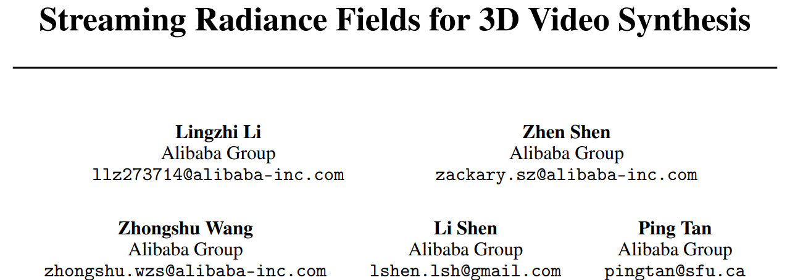

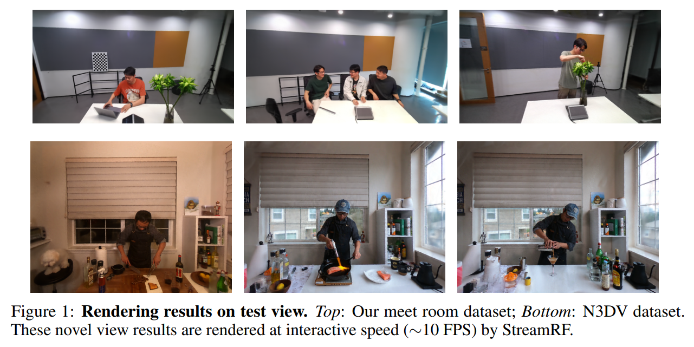

---

[12] PeRFception: Perception using Radiance Fields

- Title：PerFception：使用辐射场的感知

- Category：数据集,3D感知,语义分割,3D分类

- Project: https://postech-cvlab.github.io/PeRFception/

- Code: https://github.com/POSTECH-CVLab/PeRFception

- Paper: [pdf](https://proceedings.neurips.cc/paper_files/paper/2022/file/a76a757ed479a1e6a5f8134bea492f83-Paper-Datasets_and_Benchmarks.pdf)

- Abstract：

  > *The recent progress in implicit 3D representation, i.e., Neural Radiance Fields (NeRFs), has made accurate and photorealistic 3D reconstruction possible in a differentiable manner. This new representation can effectively convey the information of hundreds of high-resolution images in one compact format and allows photorealistic synthesis of novel views. In this work, using the variant of NeRF called Plenoxels, we create the first large-scale radiance fields datasets for perception tasks, called the PeRFception, which consists of two parts that incorporate both object-centric and scene-centric scans for classification and segmentation. It shows a significant memory compression rate (96.4\%) from the original dataset, while containing both 2D and 3D information in a unified form. We construct the classification and segmentation models that directly take this radiance fields format as input and also propose a novel augmentation technique to avoid overfitting on backgrounds of images. The code and data are publicly available in "https://postech-cvlab.github.io/PeRFception/".*

- Figure：

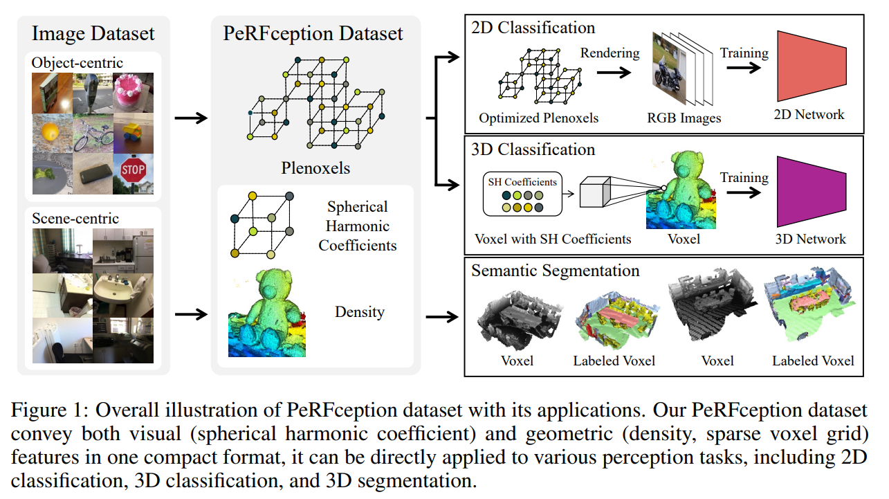

---

[] 

- Title：

- Category：

- Project: 

- Code: 

- Paper: 

- Abstract：

  > **

- Figure：

